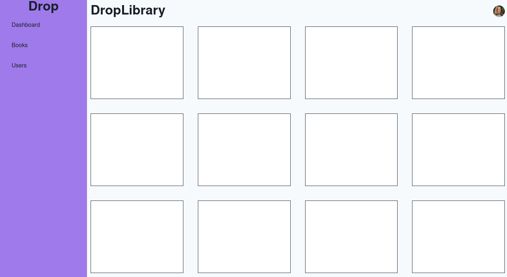

# proyecto-devops

Installation:
be located in the main folder and run the command:  

```
npm install
```
install packages in frontend-app:

```
npm run build
```

```
npm install
```


Run with Docker:  

builds Docker image from a Dockerfile:  

```
docker build -t devops-proyect .
```

creates running container from image (devops-proyect):

```
docker run -p 7000:7000 devops-proyect
```




